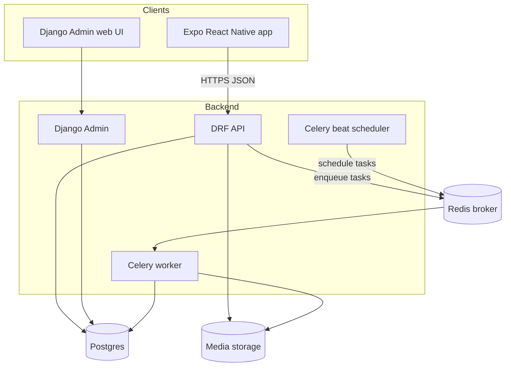

# Langame - System Architecture

## Components



- Expo app: the player-facing client. Talks only to the DRF API over HTTPS with JWT auth.
- DRF API: serves the ~6 MVP endpoints; writes raw events and enqueues background work.
- Django Admin: content authoring and ops (courses, units, lessons, vocabulary, exercises, media), plus inspecting learner state.
- Celery worker: processes attempts, updates spaced-repetition schedules, rebuilds recommendations, rolls up profiles.
- Celery beat: triggers periodic jobs (nightly recommendation rebuilds, profile roll-ups).
- Redis: Celery broker (and optional result backend / cache).
- Postgres: primary datastore for all content, events, and derived state.
- Media storage: audio and images. Local filesystem in dev; S3-compatible object storage in prod.

## Proposed repo structure

```text
langame/
  backend/                 # Django project
    config/                # settings (base/dev/prod), urls, celery app, wsgi/asgi
    apps/
      accounts/            # User, Player, JWT auth
      content/             # Language, Course, Unit, Lesson, Skill, VocabularyItem, Exercise, ExerciseItem, MediaAsset (Admin-heavy)
      progress/            # LessonProgress, ExerciseAttempt, XP, streaks
      personalization/     # LearnerProfile, MemoryState, RecommendationQueue, Celery tasks
      api/                 # DRF serializers, views, routers, schema
    manage.py
    pyproject.toml         # or requirements.txt
  mobile/                  # Expo app
    src/
      screens/
      components/
      api/                 # generated TS client from OpenAPI schema
      state/
    app.json
    package.json
  docs/
    design.md
    data-model.md
    api.md
    personalization.md
    architecture.md
  docker-compose.yml
  README.md
```

The backend is split into focused Django apps so content, progress, and personalization concerns stay separate. The `api` app holds DRF serializers/views and depends on the others; it does not own models.

## Local development

Use Docker Compose to run the full backend stack locally:

- `db`: Postgres.
- `redis`: Redis broker.
- `api`: Django dev server (DRF + Admin).
- `worker`: Celery worker.
- `beat`: Celery beat scheduler.

The Expo app runs outside Docker via the Expo CLI (`expo start`) and points at the local API URL. Media files are served from a local volume in dev.

Typical loop:

1. `docker compose up` to start db, redis, api, worker, beat.
2. Run migrations and create a superuser to access Django Admin.
3. Author one lesson in Admin.
4. `expo start` in `mobile/` and play through that lesson against the local API.

## Environments and configuration

- Settings split: `config/settings/base.py` with `dev.py` and `prod.py` overrides; select via `DJANGO_SETTINGS_MODULE`.
- Secrets and environment-specific values via environment variables (`.env` in dev; secret manager in prod). Never commit secrets.
- Database: local Postgres container in dev; managed Postgres in prod.
- Media: local volume in dev; S3-compatible storage (e.g. `django-storages`) in prod.
- Suggested hosting later: managed Postgres + Redis, containerized API and workers on a platform such as Render/Fly.io/Railway/AWS; Expo builds via EAS.

## Notes for later (not part of docs step)

- CI, Dockerfiles, migrations, and dependency pinning are deferred until after the docs are approved and scaffolding begins.
- A typed TypeScript API client should be generated from the `drf-spectacular` OpenAPI schema so the mobile app and backend stay in sync.
