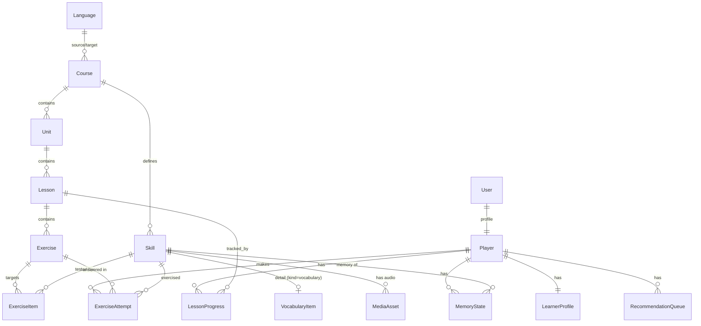
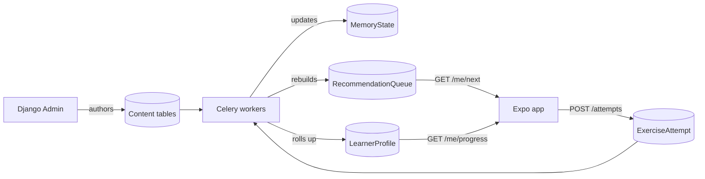

# Langame - Data Model

This document sketches the MVP domain model. It is the backbone of the product: content flows in from Django Admin, learner events flow in from the mobile app, background workers process those events, and derived personalization state flows back out to drive the next session.

A guiding decision (see "Future content types and deferred decisions" at the end): the unit a learner *masters* is a generic `Skill`, not a vocabulary word. In the MVP the only kind of skill is vocabulary, but spaced repetition, attempts, and recommendations all reference `Skill` so that future content types (grammar, reading) are additive rather than a migration.

## Entity overview

## Two organizing principles: acquisition vs retention

Two structures sit side by side, and they intentionally do different jobs:

- `Lesson` is the **acquisition / curriculum** unit: an authored, ordered, thematic set of exercises that introduces new skills in a sensible sequence and packages a bounded ~8-12 exercise session. It answers "how does a learner meet new material, in what order?"
- `Skill` + `MemoryState` is the **retention** engine: per-learner spaced-repetition state that schedules review of individual skills *across* lesson boundaries. It answers "what should this learner revisit so they don't forget?"

Lessons get skills into the learner's head in a good order; `MemoryState` keeps them there. A skill can appear in several lessons (introduced in one, reinforced in others), so it is not owned by a lesson. Completing a lesson seeds `MemoryState` for its skills, after which spaced repetition schedules them independently. This is why the recommendation queue has two modes (`new_lesson` and `review`); see [personalization.md](personalization.md).

## Content entities (Django Admin-managed)

These are authored and edited by content creators in Django Admin. No public write API in the MVP.

- `Language`
  - `code` (e.g. `en`, `he`), `name`, `direction` (`ltr` / `rtl`).

- `Course`
  - `source_language` -> `Language` (Hebrew), `target_language` -> `Language` (English).
  - `title`, `description`, `is_published`. MVP has a single HE -> EN course.

- `Unit`
  - `course` -> `Course`, `title`, `order`. Groups lessons into a theme (e.g. "Food", "Travel").

- `Lesson`
  - `unit` -> `Unit`, `title`, `order`, `is_published`.
  - A lesson is the unit of play (8-12 exercises). Explicitly created in Django Admin.

- `Skill` (the unit a learner masters; the target of spaced repetition)
  - `course` -> `Course`, `kind` (enum; MVP: `vocabulary`), `label` (human-readable, for Admin), `order`.
  - In the MVP every `Skill` has exactly one `VocabularyItem` detail. Future kinds (`grammar`, `grapheme`, `phonics`, ...) add sibling detail tables without touching `MemoryState` or `ExerciseAttempt`.

- `VocabularyItem` (vocabulary detail of a `Skill`, `kind=vocabulary`)
  - `skill` -> `Skill` (one-to-one).
  - `text_en` (the English word/phrase being taught), `part_of_speech` (optional).
  - `hebrew_hint` (optional Hebrew translation scaffold; see minimal-Hebrew principle).
  - `definition_en` (optional English gloss), `example_en` (optional example sentence).
  - `audio` -> `MediaAsset` (optional), `image` (optional).

- `Exercise`
  - `lesson` -> `Lesson`, `order`.
  - `type` (enum: `multiple_choice`, `matching`, `listening`, `typing`).
  - `payload` (JSON): type-specific data such as distractor options, prompt mode (image/audio/hebrew), and the expected answer. Keeping this as JSON avoids a separate table per exercise type and lets new exercise formats be added without a migration.

- `ExerciseItem` (join: which skills an exercise targets)
  - `exercise` -> `Exercise`, `skill` -> `Skill`, optional `role` (e.g. `target`), optional `is_primary`.
  - Unique together on (`exercise`, `skill`). An exercise targets one skill in the simplest case (a vocabulary prompt) and several for matching or, later, mixed vocabulary/grammar exercises.

- `MediaAsset`
  - `kind` (`audio` / `image`), `file` (storage path/URL), `alt_text` (optional). Audio is the priority for listening exercises.

## Player entities

Created and updated as people use the app.

- `User`
  - Django's auth user (email + password). Authentication identity.

- `Player`
  - One-to-one with `User`. Game-facing profile: `display_name`, `created_at`, `timezone`, `current_streak`, `longest_streak`, `total_xp`, `last_active_date`.

- `LessonProgress`
  - `player` -> `Player`, `lesson` -> `Lesson`, `status` (`not_started` / `in_progress` / `completed`), `completed_at`, `best_accuracy`.

- `ExerciseAttempt` (event log - the raw signal for personalization)
  - `player` -> `Player`, `exercise` -> `Exercise`, `skill` -> `Skill` (denormalized for fast aggregation; the skill being exercised).
  - `is_correct` (bool), `latency_ms` (int), `answer_given` (optional), `created_at`.
  - For an exercise that targets multiple skills, one attempt row is recorded per targeted skill, so retention can be updated per skill.
  - This table is append-only and grows quickly; it is the input to the personalization workers.

## Personalization entities (worker-written)

These are derived state, written by Celery tasks. The app reads them but does not compute them.

- `LearnerProfile`
  - One-to-one with `Player`. Rolled-up signals: `skills_learned`, `skills_due`, `accuracy_7d`, `estimated_level`, `updated_at`.

- `MemoryState` (spaced-repetition state, one per player per skill)
  - `player` -> `Player`, `skill` -> `Skill`.
  - `box` / `ease` and `interval_days` (algorithm state), `repetitions`, `due_at`, `last_reviewed_at`, `last_result`.
  - Unique together on (`player`, `skill`).
  - Formerly named `WordMemory`; generalized to any skill so vocabulary, grammar, and reading skills share one scheduling mechanism.

- `RecommendationQueue` (what to show next)
  - `player` -> `Player`, `position`, `item_type` (`review` / `new_lesson`), `skill` (nullable), `lesson` (nullable), `reason` (e.g. "due", "weak", "next in unit"), `generated_at`.
  - Rebuilt periodically by a worker; `GET /me/next` reads the top of this queue.

## Data flow

The key idea: attempts in -> workers process -> `MemoryState` / `RecommendationQueue` / `LearnerProfile` out -> the app simply renders what the backend decided.

## Future content types and deferred decisions

The schema is shaped so the two confirmed future directions are additive. The cost paid now is small (a `Skill` table, the `ExerciseItem` join, and referencing `Skill` from `MemoryState`/`ExerciseAttempt`) and it avoids migrating large event tables later.

### Worked example: grammar (future)

- Add `Skill.kind = grammar` and a `GrammarConcept` detail table (one-to-one with `Skill`: `rule`, `pattern`, examples).
- Add grammar exercise formats to the `Exercise.type` enum and `payload` (e.g. sentence building, conjugation, cloze).
- A grammar exercise links its grammar skill(s) via `ExerciseItem`, optionally mixed with vocabulary skills.
- Nothing in `MemoryState` or `ExerciseAttempt` changes; grammar skills are scheduled by the same spaced-repetition logic.

### Worked example: reading (future)

Reading decomposes into discrete decoding skills plus holistic comprehension:

- Discrete, SRS-tracked skills: add `Skill.kind` values such as `grapheme` and `phonics`, with a small `Grapheme` detail table (and possibly `sight_word`, which may just be `vocabulary`). These flow through `MemoryState` like any skill.
- Holistic content: add a `ReadingPassage` content entity (text, optional audio, difficulty). Comprehension/fluency are driven by lessons and passages, not by SRS.
- A comprehension `Exercise` references a `ReadingPassage` (a new optional `passage` FK on `Exercise`) and targets the underlying vocabulary/grammar skills via `ExerciseItem`; attempting it updates those skills' `MemoryState`.
- Caveat: read-aloud (the learner pronouncing text) needs audio capture and scoring, which belongs to the deferred speaking/pronunciation subsystem. Receptive reading (recognize, decode, comprehend) fits the current model with tap/type/listen exercises only.

### Consciously deferred (add later, additive)

Per the "balanced" future-proofing decision, these are intentionally not built now:

- Multi-language / reversed courses and a `Translation(item, language, text)` table: the single `hebrew_hint` column stays for now.
- Offline play: client-generated idempotency keys on `ExerciseAttempt` and UUID public keys.
- `Session` entity grouping attempts; richer streak/leagues/social features.
- XP / activity history (`DailyActivity` / `XpEvent`): current counters on `Player` act as a cache and can be backfilled from the append-only `ExerciseAttempt` log later.
- Content versioning (snapshotting an exercise's correct answer so edits do not change the meaning of historical attempts).
- ML-based ranking: the `MemoryState` algorithm fields and `RecommendationQueue.reason` are already generic enough to swap Leitner -> SM-2 -> FSRS -> ML without schema changes.
