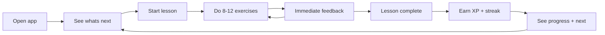

# Langame - Product Design

## Vision

Langame is a mobile vocabulary game that helps Hebrew speakers learn English through short, rewarding daily sessions. The app teaches and reinforces English words and phrases with bite-sized exercises, and a background personalization service decides what each learner should practice next so that time is spent on words they are most likely to forget.

## Target user

A Hebrew-speaking beginner-to-intermediate English learner who wants to build practical English vocabulary in short sessions on their phone.

## Minimal-Hebrew principle

The product is designed to immerse the learner in English while using Hebrew sparingly as a scaffold:

- The UI (buttons, navigation, feedback, progress) is in English.
- Hebrew appears only as an optional translation hint on a vocabulary item, mainly to help absolute beginners bootstrap meaning.
- Hebrew is stored as an optional field (`hebrew_hint`) on content, not as a separate UI locale.
- As a learner advances, Hebrew hints can be hidden so they rely on English-only cues (image, audio, English definition).
- Note on direction: Hebrew is right-to-left and English is left-to-right. Because Hebrew is limited to short hint strings, the app stays left-to-right; Hebrew hints are rendered as isolated RTL text snippets.

## Core session loop

A session is designed to take about 3-5 minutes.

1. Open the app and see "what's next" (a recommended lesson or review session).
2. Start the lesson and complete ~8-12 exercises.
3. Get immediate feedback after each exercise (correct / incorrect, with the right answer).
4. Earn XP and keep a daily streak alive on completion.
5. See updated progress and the next recommendation.

## Exercise types (MVP)

All exercises target vocabulary items (words or short phrases):

- Multiple choice: pick the correct English word for a prompt (image, audio, or Hebrew hint), or pick the correct meaning for an English word.
- Matching: match a set of English words to their meanings/images.
- Listening: hear an English word/phrase and choose or type what was said.
- Typing: type the English word for a given prompt.

## MVP scope

In scope:

- One course: Hebrew speakers learning English (HE -> EN).
- Vocabulary content authored entirely in Django Admin (units, lessons, vocabulary items, exercises, audio).
- Account creation and login.
- The full core session loop with the four exercise types above.
- XP, daily streak, and lesson completion tracking.
- Personalization v1: spaced-repetition review scheduling and a "what's next" recommendation.
- Basic progress screen (XP, streak, words learned/due).

Explicitly out of scope for the MVP:

- Speaking / pronunciation scoring.
- Grammar exercises (conjugation, sentence building).
- Social features (friends, leaderboards, sharing).
- Multiple courses or language pairs beyond HE -> EN.
- Offline mode and push-notification campaigns.
- In-app purchases / monetization.

## Personalization goal (plain terms)

The background service exists to answer one question well: "What should this learner do right now?" In the MVP that means:

- Surface words the learner is about to forget (spaced repetition).
- Mix in new words at a comfortable pace.
- Pick the next lesson when there is nothing urgent to review.

## Suggested build order (milestones)

- M0 - Foundations: Django + Postgres + Docker, Expo skeleton, auth end-to-end.
- M1 - Content in Admin: content models defined; one real lesson built entirely through Django Admin.
- M2 - Playable loop: Expo fetches a lesson, learner completes exercises, attempts saved to backend.
- M3 - Progress: XP, streaks, lesson completion, basic progress screen.
- M4 - Personalization v1: Celery + Redis, spaced repetition on words, `GET /me/next` driven by the recommendation queue.
- M5 - Polish & analytics: admin dashboards, event logging, difficulty tuning.

## Future vision

Beyond the MVP, Langame could grow into:

- Grammar and sentence-level exercises (conjugation, word order, cloze).
- Deeper listening and speaking/pronunciation practice.
- ML-based ranking of what to study next (replacing rules with a learned model), and richer learner modeling.
- Additional language pairs and reversed courses (English speakers learning Hebrew, etc.).
- Notifications, streaks/leagues, and social motivation features.
- A richer web admin dashboard beyond Django Admin for content ops and analytics.
