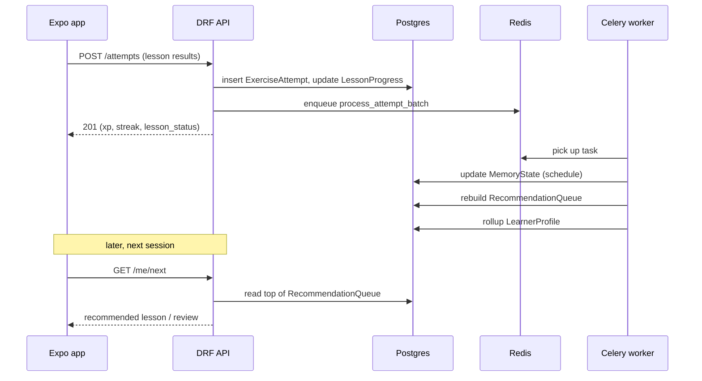

# Langame - Personalization Loop

The MVP personalization is rules-first and contains no machine learning. The goal is to surface skills the learner is about to forget, mix in new skills at a comfortable pace, and otherwise advance to the next lesson. ML-based ranking is a future enhancement, not part of the MVP.

The unit being scheduled is a `Skill` (see [data-model.md](data-model.md)). In the MVP every skill is a vocabulary word, but because scheduling is keyed on `Skill`, the same logic will later cover grammar and reading skills unchanged.

## Spaced repetition

Each (player, skill) pair has a `MemoryState` record holding the review schedule.

- Algorithm: start with a simple, well-understood scheme. Two reasonable options:
  - Leitner boxes: skills move up a box on a correct answer (longer interval) and drop back on a wrong answer (shorter interval). Very easy to reason about and debug.
  - SM-2: tracks an ease factor and interval; slightly richer scheduling.
- Decision for MVP: implement Leitner first (5 boxes with fixed intervals, e.g. 0, 1, 3, 7, 21 days). It is the simplest to build, test, and explain. The `MemoryState` fields (`box`, `ease`, `interval_days`, `repetitions`, `due_at`) are general enough to swap in SM-2 later without a schema change.
- Future: FSRS (a modern, accuracy-optimized scheduler) once there is enough data to justify it.

### When is a skill "due"?

A `MemoryState` is due when `due_at <= now`. Skills the learner has not yet encountered (no `MemoryState` yet) are treated as "new" and introduced gradually.

## Celery tasks

Two kinds of work run in the background via Celery (broker: Redis).

1. On-attempt task (event-driven): `process_attempt_batch(player_id, attempt_ids)`
   - Triggered after `POST /attempts` records the raw `ExerciseAttempt` rows.
   - For each attempt, updates the corresponding `MemoryState`: advance/demote the box, recompute `interval_days` and `due_at`, set `last_result` and `last_reviewed_at`.
   - Lightweight and fast; keeps the request path quick by doing the scheduling math asynchronously.

2. Periodic task (Celery beat): `rebuild_recommendations(player_id)` and `rollup_learner_profile(player_id)`
   - Runs on a schedule (e.g. nightly) and/or on demand after a session.
   - `rebuild_recommendations` regenerates `RecommendationQueue`:
     - First, due reviews (`MemoryState.due_at <= now`), prioritized by how overdue / how weak.
     - Then, a capped number of new skills from the next lesson in the active unit.
     - Falls back to "next unstarted lesson" when there is nothing to review.
   - `rollup_learner_profile` recomputes `LearnerProfile` aggregates (`skills_learned`, `skills_due`, `accuracy_7d`, `estimated_level`).

For the MVP, `process_attempt_batch` can also enqueue a per-player `rebuild_recommendations` so the next `GET /me/next` reflects the session that just happened, in addition to the nightly beat run.

## The loop end to end

## Why this design

- The request path stays fast: the API only writes raw events and returns immediate rewards; scheduling and ranking happen in workers.
- Derived state (`MemoryState`, `RecommendationQueue`, `LearnerProfile`) is cleanly separated from raw events (`ExerciseAttempt`), so the algorithm can be changed or replaced (Leitner -> SM-2 -> FSRS -> ML) without touching the app or the event log.
- It is debuggable: every recommendation carries a `reason`, and the schedule is fully inspectable in Django Admin.
